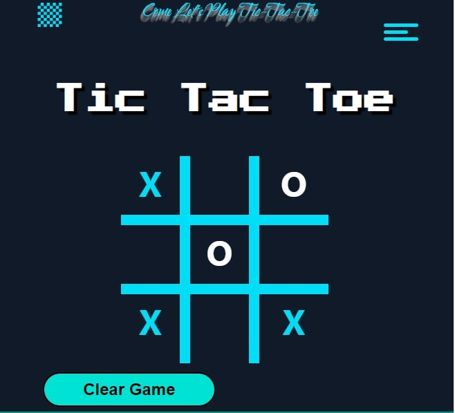

# Tic Tac Toe game

## Welcome! 👋

Check out my [Tic Tac Toe](https://tictactoe-myproject03.netlify.app/) game website.

This project is build using :

- React
- HTML, CSS, and JS

### About this project

- This project is one of my first react apps. It is a simple game of tic tac toe.
  - It is a two player game.
- Like every other tic tac toe game, two players mark the box one by one each turn and try to make a pair of three in straight line.
  - You can check out the tips to play in the Help section of the website.
- When a player wins, a winning window pops up to display result or else you refresh the game on a draw.

### Tips

- You can play or make it better. Just fork it and make your own better version. 
- The score page isn't made yet so you can try it out.
- The draw condition can also be improved.

## Me

Hey there! My name is Mohd Saad. I am an aspiring Web Developer and currently a Btech student.
If you like this project then you can star this repo and if you want to work in a team on any project, contact me via mail or on my [LinkedIn](https://www.linkedin.com/in/webdevmsaad/) profile.
